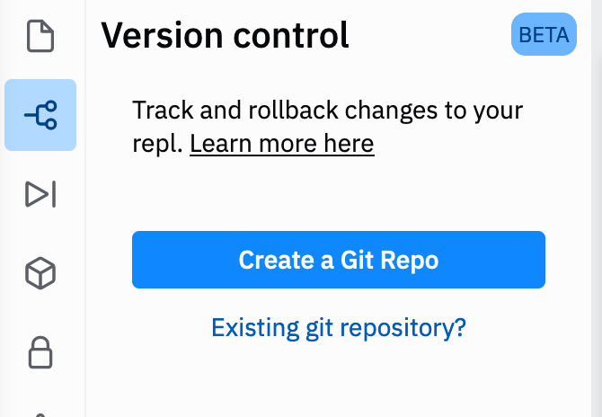
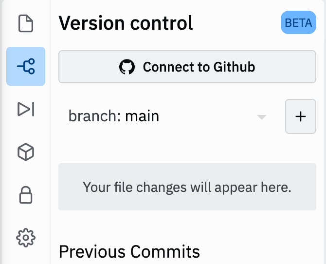

# Week 12

## Question 1

### Complete the outline action method ```countdown(int x)``` which :

1. accepts an positive integer x as an argument
2. prints a descending column of numbers from x to 1
3. each number should have the next letter of "CODE" beside it (start sequence again with C when E printed)

For example calling ```countdown(6)``` would print

```
6 C			
5 O			
4 D			
3 E			
2 C
1 O
```

### Outline Solution

We need a counter controlled loop going from x down to 1 and in loop:

1. Print x
2. Print correct character 'C' 'O' 'D' or 'E'

** How many solutions can you Create? **

1. Using an array to store chars in C O D E
2. Using a string to store C O D E
3. Using an if statement to determine which char in C O D E to print
4. Using % operator to determine which char in C O D E to print
5. if you come up with a unique solution of your own then let me know!!


### Test Solution
Complete outline method ```question1()``` so that it prompts a user to enter a positive number then call countdown with this number and verify output is as expected


### Upload Solution to Github
You should try to maintain a Github account with examples of algorithms you may have developed during your time at University.

1. Go to https://github.com and create an account (use your university email address)


2. Click on the Version Control icon in your solution toolbar and click "Create a Git Repo"

 


3. Then click Connect to Github and enter your github credentials.

When you make changes to your repl you can "push" these changes to your github account.




## Question 2

### Complete the following outline methods in the Morse class

1. ```String messageToMorse(String msg)``` encode msg into a morse string and return as method result
2. ```String messageFromMorse(String morse) ``` decode morse into a message string and return as method result

### Test Solution

Complete question2() method so that:

1. it prompts a user to enter a message (String), 
2. call Morse.messageToMorse(...) to encode the message and store the morse in a string
3. call Morse.messageFromMorse(...) to decode this morse back into a string
4. print the morse and the decoded message to prove that it works


### Notes

The String class has methods that will be useful including ```length()``` which returns the length of a string and ```charAt(int i)``` which returns the character in the string at the specified index position (string indexes start at 0 like and array)

```
String s = "hello";
int length = s.length();           // 5
char c1 = s.charAt(0);             // 'h'
char c2 = s.charAt(s.length()-1);  // 'o'
```

The StringTokenizer class is used to parse a string (break it up into pieces). The following demonstrates the key methods needed to create Tokenizer and then create a sentinel loop and extract each token (a morseCode version of a character) so that it can be decoded whilst the tokenizer has more tokens available.

```
// break string into tokens at each space
// available tokens are "."    "--."    and "----" as they are separated by space " "
StringTokenizer tokenizer = new StringTokenizer(". --. ----, " "); 

boolean more = tokenizer.hasMoreTokens()            // true
String token = tokenizer.nextToken();               // "."

```


## Question 3

1. Complete outstanding Questions from previous practicals
2. Ask for guidance in any topics we have covered where you feel need further help

